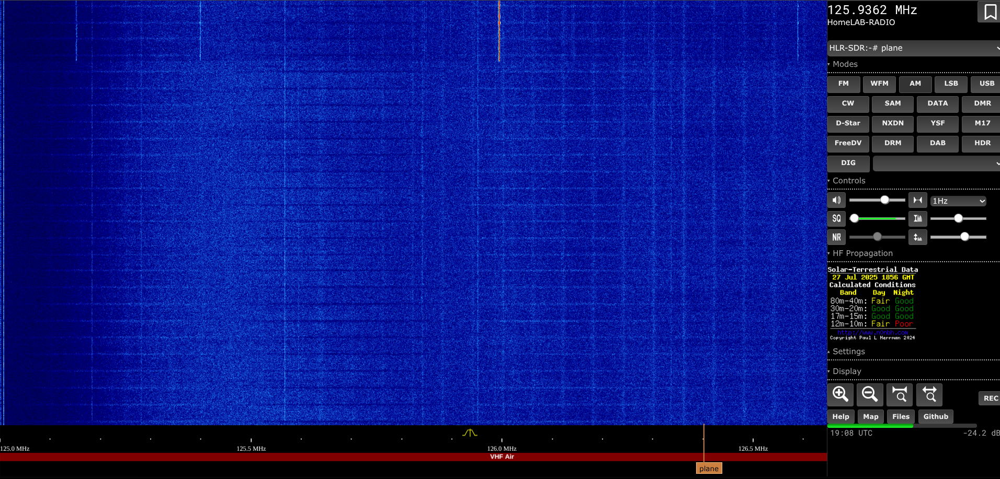

# **HomeLAB-Radio: Your Personal WebSDR Setup**


## **Hi There\! What is HomeLAB-Radio All About?**

HomeLAB-Radio is a modified version of OpenWebRX+, I made to to unleash the full potential of the client side code. I've added some cool changes to how it looks and other things, so you get a really nice experience with your software-defined radio in your own space. **It's actually designed to look a lot like the original WebSDR dist11 client, which I thought was pretty neat\! I just made this whole thing in my homelab while messing around, and that's how it got its name.**

The main goal here is to make it super easy way to have a great extremely customizable web-based SDR up and running quickly on any linux device.

## **What's New and Different?**

* **Custom Look:** I've swapped out the usual OpenWebRX+ web pages with a custom design. no more annoying header up top because i put it into the reciver controls panel. and the reciver controls are built into the web page instead of the little pop up menu, that makes it nice and sleek. the coolest thing i did to it was changed the tuning bar to look exactly like the original WebSDR software. also I changed the layout of the whole reciving area to mimic the original WebSDR software.
* **Quick Install:** There's just one simple command to get everything set up. It takes care of all the necessary parts, installs OpenWebRX+, and then adds all my custom changes.  
* **Smart OS Helper:** The installation script is smart\! It figures out if you're using Ubuntu (versions 22.04, 24.04) or Debian (Bullseye, Bookworm) to make sure everything gets set up correctly.  

## **How to Install It**

Getting HomeLAB-Radio going is designed to be as simple as possible. Just copy and paste this one command into your Linux terminal:

**The Easy Install Command:**
```
wget https://raw.githubusercontent.com/Rad-nerd/HomeLAB-Radio/master/install.sh
chmod +x install.sh
bash install.sh
```
**What Happens When You Run This Command:**

1. The install.sh script is downloaded from the master branch of the HomeLAB-Radio GitHub page.  
2. Then, that script runs with special administrator permissions (sudo).  
3. After that, the script will do these things step-by-step:  
   * It will ask you for your sudo password.  
   * Your system's software lists will be updated, and all the tools it needs will be installed.  
   * It will figure out which Linux system and version you are using (Ubuntu 22.04/24.04, Debian Bullseye/Bookworm).  
   * The special places where OpenWebRX+ software packages are kept will be added to your system.  
   * The regular OpenWebRX+ software package will be installed.  
   * The HomeLAB-Radio project files will be copied or updated from GitHub to make sure you have the latest changes.  
   * **Importantly, it will make a backup of your original OpenWebRX+ web files, and then put your custom HomeLAB-Radio look in their place.**  
   * Finally, the OpenWebRX+ service will be started or restarted.

## **How to Use It**

Once everything is installed, HomeLAB-Radio should be ready for you to configure and use in your web browser.

* Just open your web browser and go to this address: http://\<YOUR\_SERVER\_IP\_ADDRESS\>:8073  
  * Remember to change \<YOUR\_SERVER\_IP\_ADDRESS\> to the actual address or name of your server.  
  * The standard port for OpenWebRX+ is 8073\.
  * **NOTE:** you cannot go to settings from the UI itself anymore \(because what if your arent the server admin and the settings button is for the server admin. so i removed
    it\) you have to go to http://\<YOUR\_SERVER\_IP\_ADDRESS\>:8073/settings
   
## **What's Coming Next?**

* **Docker Install:** In the future, we're planning to add an even simpler way to install it using Docker. This will make it even easier to move around and keep separate from other things on your system.
* **Modding from the UI:** also we will have modding \(the UI itself\) from the UI with NO CODING\! so you can have your own custom WebSDR with no learning curve/! oh did i mention that there is no real logo in the page so you can name your websdr whatever you dang want\!  
* *We might also add other cool features, like better ways to see what's happening behind the scenes.*

## **Need Help or Want to Contribute?**

If you run into any problems, please let us know by opening an issue on the [HomeLAB-Radio Issues page](https://github.com/Rad-nerd/HomeLAB-Radio/issues).

We'd love your help\! If you have ideas for how to make it better or new features, feel free to send in a "pull request."

## **License Info**

This project is open for anyone to use and change. You can find all the details about how you can use it in the LICENSE file in the project.

## **Get in Touch**

This project was put together by Lucas (Rad-nerd).  
Find me on GitHub: Rad-nerd
